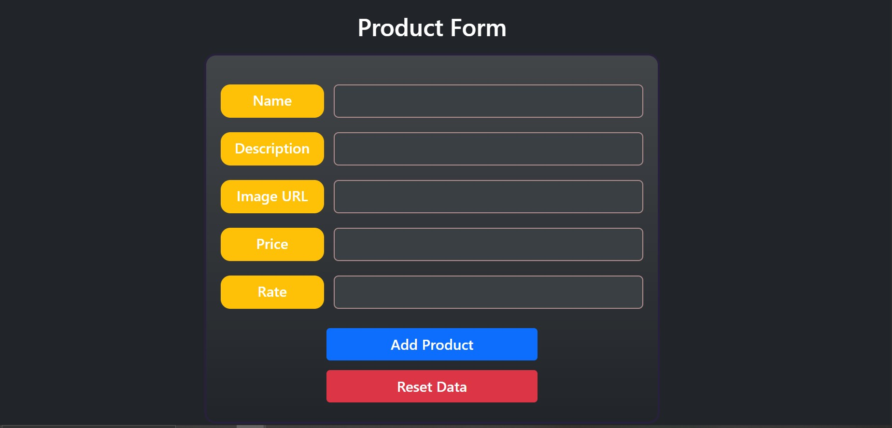
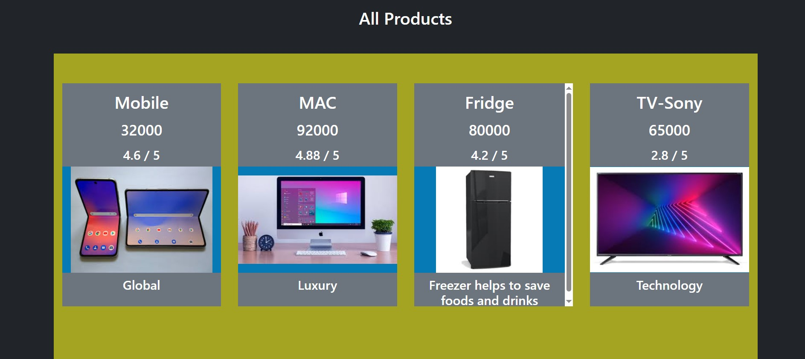

# Angular-Product-Storage
## Ractive Forms Validation 
## Event Binding and Attribute binding - Control Flow 
## Passing Data From CHild to parent and from child to child through parent midway
<a href="https://youtu.be/WHRhbfnmTjY">Demo</a>

